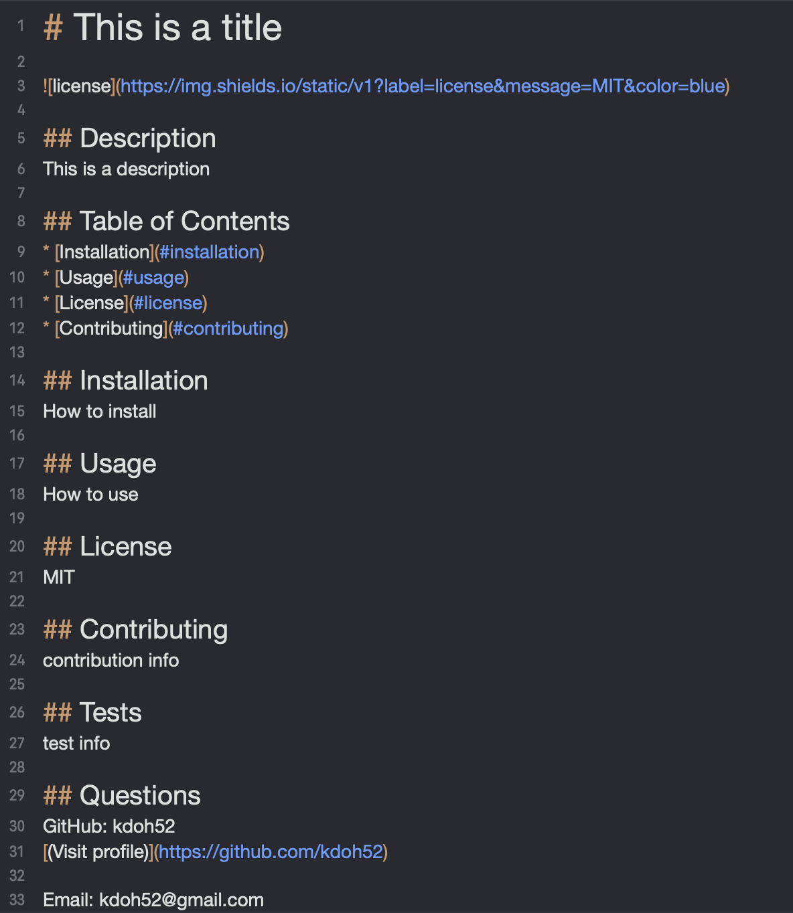

# HW 9 (Node.js and ES6+): README Generator

## Description
This application is a README Generator, intended to be used on the command line. The app prompts the user to input all of the necessary information and then generates the appropriate headings, badges, links, etc.

## Demo video

## Credits
* Javascript
* Node.js
* prompt (https://github.com/flatiron)

## Contact
* kdoh52@gmail.com
